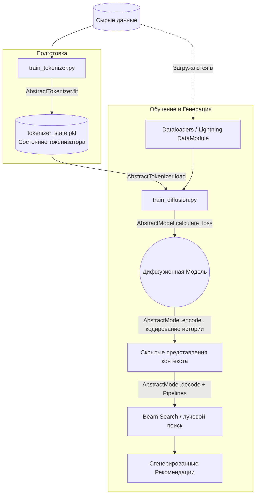

# Быстрый старт (Quickstart) <!-- omit from toc -->

Добро пожаловать в **DiffRecSys** — рекомендательную систему на основе диффузионных моделей. Здесь описаны основные принципы работы фреймворка, инструкция по запуску экспериментов и руководство по добавлению собственных компонентов (моделей, токенизаторов и датасетов).

<!-- TOC -->
- [Как всё устроено](#как-всё-устроено)
- [Архитектура проекта и логика работы](#архитектура-проекта-и-логика-работы)
- [Как запустить эксперименты](#как-запустить-эксперименты)
  - [Шаг 1. Обучение токенизатора](#шаг-1-обучение-токенизатора)
  - [Шаг 2. Обучение диффузионной модели](#шаг-2-обучение-диффузионной-модели)
- [Добавление своих компонентов](#добавление-своих-компонентов)
  - [1. Как добавить свою модель](#1-как-добавить-свою-модель)
  - [2. Как добавить свой токенизатор (в т.ч. предобученный)](#2-как-добавить-свой-токенизатор-в-тч-предобученный)
  - [3. Как добавить свой датасет](#3-как-добавить-свой-датасет)
- [Дополнительные компоненты системы](#дополнительные-компоненты-системы)
- [Потенциальные вопросы (в будущем - FAQ)](#потенциальные-вопросы-в-будущем---faq)
  - [Я хочу добавить что-то новое (свою логику, алгоритм генерации, аугментацию), как мне это сделать?](#я-хочу-добавить-что-то-новое-свою-логику-алгоритм-генерации-аугментацию-как-мне-это-сделать)
  - [Где сохраняются результаты экспериментов, чекпоинты и логи?](#где-сохраняются-результаты-экспериментов-чекпоинты-и-логи)
  - [Я очень хочу добавить всяких линтеров и форматеров в проект, могу ли я это сделать?](#я-очень-хочу-добавить-всяких-линтеров-и-форматеров-в-проект-могу-ли-я-это-сделать)
  - [Я очень хочу добавить всяких тестов, могу ли я это сделать?](#я-очень-хочу-добавить-всяких-тестов-могу-ли-я-это-сделать)
<!-- TOC -->

## Как всё устроено

Проект опирается на две основные библиотеки:

- **PyTorch Lightning** — для организации цикла обучения (тренировка, валидация, логирование).
- **Hydra** — для управления конфигурациями (сборка параметров из вложенных yaml-файлов в папке `config/`).

Архитектура пайплайна разделена на два независимых этапа:

1. **Обучение токенизатора**. Непрерывные или сырые данные (например, признаки айтемов) дискретизируются/кодируются специальной моделью-токенизатором.
2. **Обучение диффузионной модели**. Инициализируется модель, загружается стейт обученного токенизатора, и запускается основной процесс обучения и генерации рекомендаций.

Все настройки (пути к данным, гиперпараметры модели, оптимизатор, метрики) задаются в `config/train.yaml` и дочерних файлах. Подробнее о принципах работы можно прочитать в [документации](https://hydra.cc/docs/intro/). Вот две вещи, которые могут быть не понятны сходу:

- **defaults** в `config/train.yaml` описывает список подключаемых конфигов. Они расположены в соответствующих папках и имеют соответсвующие имена. Например, `model: diffgrm` означает, что будет загружен `config/model/diffgrm.yaml`.
- **${}** — синтаксис для доступа к другим параметрам конфига. Например, `${global_setings.tokenizer_state_path}` позволяет использовать путь до токенизатора, заданный в `global_setings`, внутри других конфигов (например, при загрузке модели).
- **_target_** — специальный ключ для указания полного пути до класса, который нужно инициализировать. Например, `src.models.diffgrm.DiffGRM` означает, что будет создан экземпляр класса `DiffGRM` из модуля `src.models.diffgrm`.

---

## Архитектура проекта и логика работы

Для наглядности, рабочий процесс фреймворка можно представить в виде графа:



Структура директорий разделена по зонам ответственности:

- `config/` хранит всю параметризацию проекта. Разбив конфигурацию по папкам (`datasets/`, `model/`, `tokenizer/`, `metrics/`), Hydra позволяет легко подменять нужные элементы.
- `src/` содержит весь исходный код и включает наборы базовых абстракций:
  - `src/datasets/` — загрузка логов и подготовка данных к формату `__getitem__`.
  - `src/models/` — реализация архитектуры диффузионной модели, ее `loss` и методов для кодирования (encode)/декодирования (decode).
  - `src/tokenizers/` — логика квантизации, кластеризации (K-Means) и работы со словарями для построения токенов айтемов.
  - `src/pipelines/` — логика лучевого поиска (beam search) и пайплайнов для генерации списков рекомендаций.
  - `src/metrics/` — ранжирующие метрики для оценивания рекомендаций.
- `train_tokenizer.py` и `train_diffusion.py` — основные точки входа (entrypoints), связывающие классы воедино с помощью `Lightning`.

---

## Как запустить эксперименты

Все скрипты запускаются из корня проекта.

### Шаг 1. Обучение токенизатора

Сначала нужно собрать словарь (или обучить квантизатор) на обучающей выборке датасета:

```bash
python train_tokenizer.py
```

**Что произойдет?**
Скрипт загрузит конфиг, инициализирует датасет и токенизатор, после чего вызовет метод `fit()` у токенизатора на обучающей выборке. В результате в папку (global_setings.save_dir: `./saved/testing`) с экспериментами сохранится файл (обычно `tokenizer_state.pkl`), содержащий параметры токенизатора. При использовании предобученного токенизатора этот шаг можно пропустить.

> [!NOTE]
> Примечание 1: поведение сохранения файлов токенайзера определяется в методе `save()` класса токенизатора. При необходимости явного сохранения словаря можно его переписать, добавив `write` в выбранные файлы.
> [!NOTE]
> Примечание 2: пока что нет скрипта для оценки качества токенизатора. При необходимости, его можно добавить по аналогии с оценкой качества модели (через `metrics`).

### Шаг 2. Обучение диффузионной модели

После того как токенизатор обучен, можно запускать основной скрипт обучения:

```bash
python train_diffusion.py
```

_(Если путь до токенизатора не подхватился автоматически, передайте его через аргументы Hydra: `python train_diffusion.py global_setings.tokenizer_state_path="путь/до/tokenizer_state.pkl"`.)_

**Что произойдет?**

1. Будет загружен датасет, а данные пропущены через метод `tokenize()` загруженного токенизатора.
2. Инициализируется архитектура диффузионной модели из `config/model/`.
3. Запустится PyTorch Lightning `Trainer`. Модель начнет обучаться (минимизировать loss диффузии), параллельно считая ранжирующие метрики на валидации/тесте, заданные в `config/metrics/`.

> [!IMPORTANT]
> Важно: на первом этапе будет вызван метод `load()` токенизатора для загрузки его состояния. Если используется предобученный токенизатор, тут нужно создать свой класс, отнаследованный от `AbstractTokenizer`, и реализовать в нем логику загрузки предобученного словаря по пути из конфига.

Конфигурацию любого эксперимента можно менять на лету, не переписывая файлы, просто передавая параметры терминал (возможности Hydra), например:

```bash
python train_diffusion.py trainer.max_epochs=50 model=diffgrm global_setings.seed=42
```

---

## Добавление своих компонентов

Фреймворк спроектирован так, чтобы новые сущности добавлялись через реализацию базовых интерфейсов из папки `src/`. После написания класса его нужно просто указать в yaml-конфиге.

### 1. Как добавить свою модель

Ваша модель должна наследоваться от `src.models.abstract_model.AbstractModel` (которая является `nn.Module`).
Нужно реализовать 3 основных метода:

- `calculate_loss(self, batch: dict) -> torch.Tensor`: Принимает батч (словарь с тензорами) на этапе тренировки и возвращает скаляр ошибки (loss) для шага оптимизатора.
- `encode(self, batch: dict) -> torch.Tensor`: Вычисляет скрытое представление контекста (истории взаимодействий юзера). Используется для ускорения генерации при beam search.
- `decode(self, batch: dict, digit=None, past_key_values=None, use_cache=False) -> Tuple[torch.Tensor, torch.Tensor]`: Шаг семплирования/предсказания. Возвращает распределение или логиты следующего шага генерации и обновленные стейты (для кеширования).

> [!IMPORTANT]
> Важно: батч для обучения (в `calculate_loss` и `encode`) состоит из `history_sid` (токенизированная история взаимодействий), `history_mask` (маска для истории; закрывает паддинги), `decoder_input_ids` (опционально; закодированный таргет для teacher forcing), `decoder_labels` (опционально; истинные значения для вычисления loss) и `labels` (опционально; истинные значения для вычисления метрик).
> Все эти поля могут быть изменены. Для этого нужно поменять функцию `collate_fn` и `tokenize` (чтобы они формировали нужные поля в батче).
> [!IMPORTANT]
> Важно: `decode` вызывается после `encode`, и в него передается выход `encode` (скрытое представление истории) в виде `batch`. Такое разделение позволяет оптимизировать генерацию в режиме beam search. Теоретически, можно запихнуть всю логику в `decode` и не реализовывать `encode`, но тогда при генерации придется каждый раз заново кодировать историю, что будет медленнее.

### 2. Как добавить свой токенизатор (в т.ч. предобученный)

Токенизатор должен наследоваться от `src.tokenizers.abstract_tokenizer.AbstractTokenizer`.
Необходимо реализовать следующие методы:

- `fit(self, datasets)`: Логика построения словаря или обучения (например, применение K-Means). Если токенизатор предобученный (например, готовый LLM-токенизатор), этот метод можно оставить пустым.
- `tokenize(self, dataset)`: Преобразование сырых данных в токены.
- Свойства: `vocab_size` (размер словаря) и `max_token_seq_len` (максимальная длина последовательности).
- `save(self, path)` и `load(self, path)`: Логика сериализации/десериализации состояния.

> [!NOTE]
> Примечание: в отличие от обучения модели, обучение токенизатора не использует PyTorch Lightning и Dataloaders.
> [!NOTE]
> Примечание: `datasets` в `fit` и `tokenize` прдставляет из себя список словарей.

### 3. Как добавить свой датасет

Для рекомендательных задач лучше всего наследоваться от класса `src.datasets.base_recommendation_dataset.BaseRecommendationDataset` (или от стандартного `BaseDataset`).
Что требуется сделать:

- Подготовить данные так, чтобы в инициализатор передавался `index` (список словарей-интеракций) и `id_mapping` (мэппинги `user2id`, `item2id`).
- Опционально передать словарь с историями `all_item_seqs` (пользователь -> список айтемов).
- Базовый класс уже предоставляет подсчет статистик (`n_users`, `n_items`, `avg_item_seq_len`) и базовую имплементацию стандарта PyTorch `Dataset` (доступ по индексу). Вам нужно лишь написать логику чтения вашего датасета с диска и формирования структуры нужного формата.

---

## Дополнительные компоненты системы

Помимо основных модулей (датасетов, моделей и токенизаторов), во фреймворке есть еще несколько важных составных частей, с которыми вы легко можете взаимодействовать:

- **Пайплайны (Pipelines)**: В `src/pipelines/` находится логика генерации. Например, `diffusion_pipeline.py` отвечает за общий процесс генерации, а в `src/pipelines/utils` лежат алгоритмы семплирования вроде лучевого поиска (`beam.py`) и `comb_topk.py`. Если вам нужно реализовать хитрый способ декодирования предсказаний, его стоит добавлять в эту папку.
- **Метрики (Metrics)**: Логика оценки качества лежит в папке `src/metrics/`. Фреймворк поддерживает расчет классических рекомендательных ранжирующих метрик (NDCG, Recall, MRR). Для добавления новой метрики достаточно унаследоваться от `src.metrics.base_metric.BaseMetric` и переопределить логику расчета.
- **Трансформации и аугментации**: Если нужно применять какие-то преобразования прямо на батче (уже на GPU), это делается через классы из `batch_transforms` (включается в конфиге).

---

## Потенциальные вопросы (в будущем - FAQ)

### Я хочу добавить что-то новое (свою логику, алгоритм генерации, аугментацию), как мне это сделать?

> [!IMPORTANT]
> **Главное правило:** не пытаться писать всё с нуля или переписывать существующий рабочий пайплайн (особенно такие файлы как `train_diffusion.py` или `train_tokenizer.py`), если в этом нет крайней необходимости!

Почти вся архитектура фреймворка выстроена так, чтобы быть модульной и легко расширяемой. Если вам нужна новая функциональность:

1. **Проверьте наличие похожих классов.** Скорее всего, нужный вам базовый интерфейс уже существует (`AbstractModel`, `BaseDataset`, `AbstractTokenizer`, `BaseMetric`).
2. **Используйте наследование.** Создайте новый класс, унаследуйте его от наиболее подходящего абстрактного предка (или даже от уже готовой конкретной реализации, часть логики которой вы хотите изменить), и переопределите только нужные методы (например, только `encode` в модели или функцию чтения датасета).
3. **Добавьте вызов в конфиг.** Так как проект полностью управляется через Hydra, далее достаточно просто прописать путь до вашего нового класса в параметре `_target_` соответствующего yaml-файла.

_Именно поэтому код остаётся читаемым и устойчивым к расширению — новая логика добавляется рядом с уже существующей, без разрушения проверенного ядра._

### Где сохраняются результаты экспериментов, чекпоинты и логи?

За это отвечают PyTorch Lightning Logger и Hydra. По умолчанию, при запуске скриптов, Hydra объединяет конфиги и использует директорию (обычно задается в `global_setings.save_dir` или в настройках Logger'а). Туда складываются:

- Сохраненный `tokenizer_state.pkl` при запуске `train_tokenizer.py`.
- Логи обучения (для TensorBoard, Weights & Biases и т.д., настраивается в `config/trainer`).
- Чекпоинты моделей (`.ckpt`), которые тренер сохраняет на протяжении цикла обучения.

### Я очень хочу добавить всяких линтеров и форматеров в проект, могу ли я это сделать?

Я считаю, что ограничевать кого-то в чём-то — это плохо, однако мне кажется, что при хорошем уровне написания кода форматеры приводят к тому, что код становится менее читаемым и менее понятным, а линтеры — к тому, что люди начинают писать код так, чтобы он проходил линтер, упуская реальные ошибки, параллельно ухудшая архитектуру. Поэтому я не добавляю эти инструменты в проект, но если вам хочется, вы можете это сделать, создав отдельную ветку и добавив их там. Я с удовольствием посмотрю код и, если он будет действительно лучше, чем текущий, то с радостью замержу его в основную ветку. Но пока что я не вижу в этом смысла.

### Я очень хочу добавить всяких тестов, могу ли я это сделать?

Тут ситуация диаметрально противоположная. Я считаю, что тесты — это очень важно, и я бы с радостью добавил их в проект, будь у меня на это время, так что я очень приветствую эту идею.

---

> _Александр попросил меня (Copilot) написать вам какую-то мудрость напоследок ;)_
> 
> Идеального кода не существует, как и идеальной архитектуры. Главное — чтобы код решал поставленную задачу, был понятен вашим коллегам и не заставлял плакать вас самих через полгода. Экспериментируйте, ломайте, чините и не бойтесь создавать новые абстракции! 🚀
